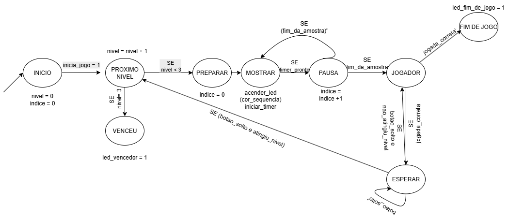
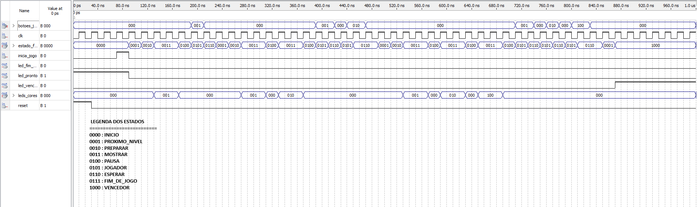

# Jogo Genius em VHDL

## 📖 Sobre o Projeto

Este repositório contém o **projeto final** da disciplina de Sistemas Digitais, consistindo na implementação de um jogo da memória do tipo "Genius" (também conhecido como Simon) em VHDL. O circuito foi projetado para ser totalmente funcional, executando o jogo por três níveis de dificuldade e culminando em uma condição de vitória ou derrota para o jogador.

O projeto foi desenvolvido seguindo uma metodologia formal de projeto RTL, com uma arquitetura particionada que separa a lógica de controle da lógica de operações.

## Arquitetura do Sistema

O design foi particionado em uma arquitetura clássica de Unidade de Controle e Caminho de Dados (Datapath) para modularizar a complexidade e facilitar o projeto e a depuração.

* **Unidade de Controle (FSM):** O "cérebro" do sistema. É uma Máquina de Estados Finitos (FSM) de 9 estados, responsável por sequenciar todas as etapas do jogo. A lógica combinacional desta FSM foi implementada diretamente através de equações booleanas, conforme os requisitos do projeto.
* **Caminho de Dados (Datapath):** Os "músculos" do sistema. Contém todos os componentes que armazenam e manipulam os dados, incluindo:
    * Contadores de 2 bits para o nível atual e para o índice da sequência.
    * Uma memória ROM para armazenar a sequência de cores fixa do jogo.
    * Circuitos comparadores para validar a jogada do usuário e verificar as condições de fim de nível.
    * Um timer para controlar a duração em que cada LED permanece aceso.

---

## 📂 Estrutura dos Arquivos

O projeto está organizado nos seguintes arquivos VHDL:

* `genius_game.vhd`: Entidade de mais alto nível, que conecta a Unidade de Controle e o Datapath.
* `control_unit.vhd`: A Unidade de Controle, que contém a FSM.
* `logica_comb_fsm.vhd`: A lógica combinacional da FSM, implementada com equações booleanas.
* `registrador_4bits.vhd`: O registrador de 4 bits que armazena o estado atual da FSM.
* `datapath.vhd`: O Caminho de Dados, contendo todos os componentes operacionais.

---

## 🛠️ Metodologia e Ferramentas

* **Metodologia:** Projeto RTL (Nível de Transferência de Registradores).
* **Linguagem:** VHDL.
* **Ferramenta de Simulação: ModelSim
* **Ferramenta de Síntese: Intel Quartus Prime

---

## 🚀 Como Simular

1.  Compile todos os arquivos `.vhd` na ordem de dependência em uma ferramenta de simulação compatível com VHDL.
2.  Inicie uma simulação da entidade `genius_game`.
3.  Para começar, aplique um pulso no sinal `reset` (de '1' para '0').
4.  Em seguida, aplique um pulso no sinal `inicia_jogo` (de '0' para '1' e de volta para '0').
5.  Manipule o barramento `botoes_jogador` para simular as jogadas do usuário nos momentos apropriados. A simulação completa do jogo (3 níveis) pode ser observada na imagem abaixo.

